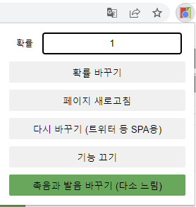
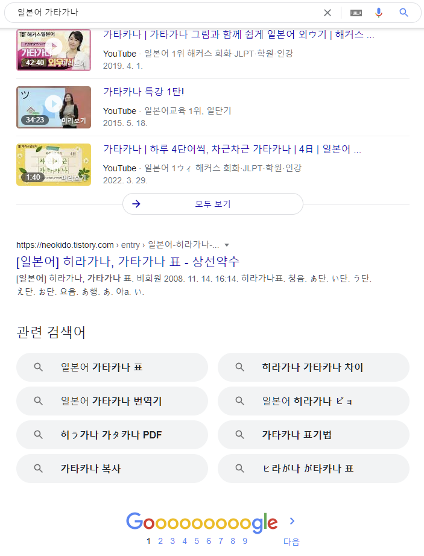

# ToKana
웹에서 한글의 일부를 비슷한 발음의 가나로 바꿔 주는 Chrome Extension입니다. [Tweet](https://twitter.com/I_Ia_oO/status/1526738284260470784)에서 영감을 얻었습니다.

## 기능 설명
* 확률 바꾸기, 페이지 새로고침, 기능 끄기, 촉음과 발음 바꾸기 버튼은 페이지를 새로고침하여 변경 사항을 반영합니다. 기능 끄기, 촉음과 발음 바꾸기 버튼은 on/off 버튼입니다.
* 확률은 0과 1 사이의 숫자입니다. 페이지에서 바꿀 수 있는 문자를 확률에 따라 일부만 바꿀 수 있게 합니다. 기본값은 `0.1`입니다.
* 다시 바꾸기는 무한 스크롤 등으로 페이지 내용이 바뀌어 기능이 적용되지 않는 부분에 기능을 수동으로 적용시키는 버튼입니다. 기능 끄기 on 상태에서도 동작합니다.
* 촉음 っ, ッ와 발음 ん, ン은 다음 규칙에 따라서 쓰입니다. 바뀌는 것이 거슬리거나 느린 것 같으면 제외할 수 있습니다. 아주 느리지는 않기 때문에 기본값은 on입니다.
  * っ, ッ은 가행 앞에서 ㄱ, 사행 앞에서 ㄴ, 타행 앞에서 ㅅ, 파행 앞에서 ㅂ입니다.
  * ん, ン은 바, 파, 마행 앞에서 ㅁ, 자, 타, 다, 나, 라행 앞에서 ㄴ, 카, 가행 앞에서 ㅇ, 아, 사, 하, 야, 와행 앞이나 단어 끝에서 ㄴ입니다.

## 설치 방법
수동으로 크롬 주소에서 `chrome://extensions/`에 들어갑니다. 개발자 모드를 켜고 `압축해제된 확장 프로그램을 로드합니다.`를 클릭합니다. 해당 리포지토리의 파일들이 있는 폴더를 선택합니다.

## 예시
다음은 확률 `0.1`로 구글 검색 결과 페이지에 ToKana를 적용한 모습의 예시입니다.

